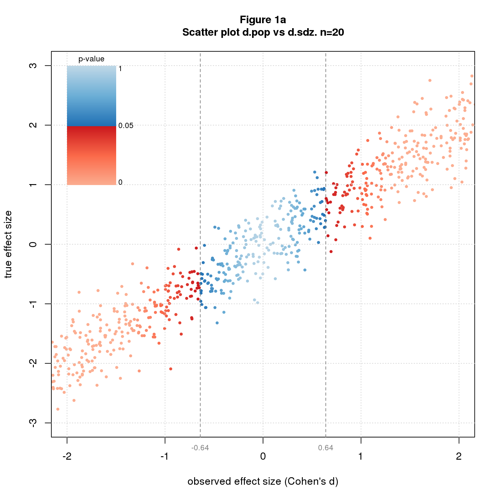
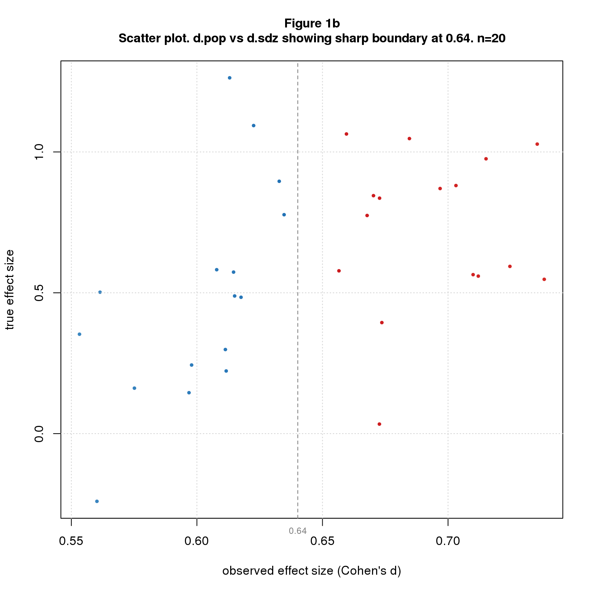
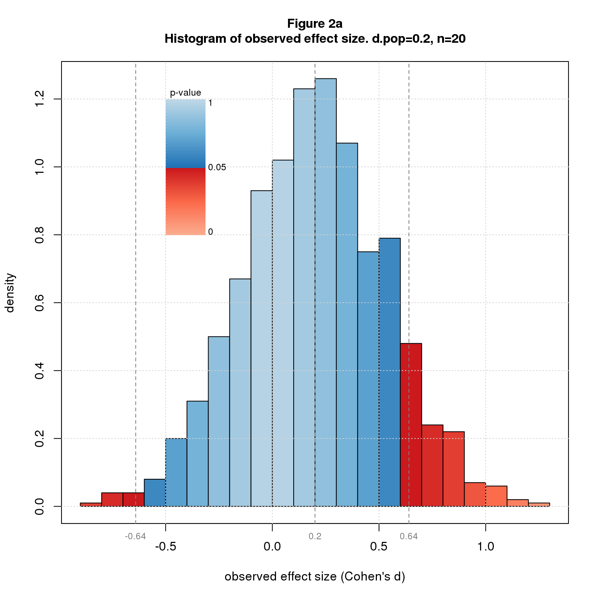
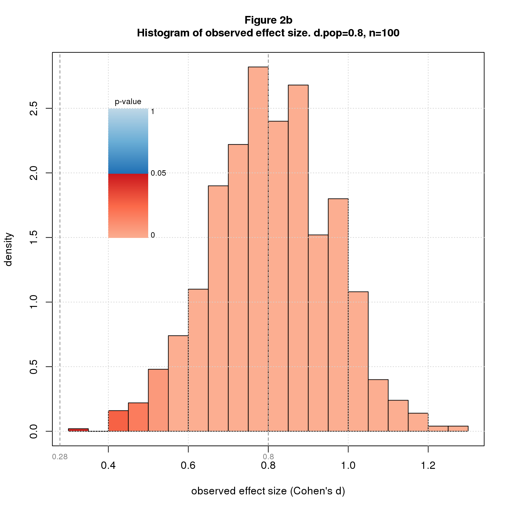
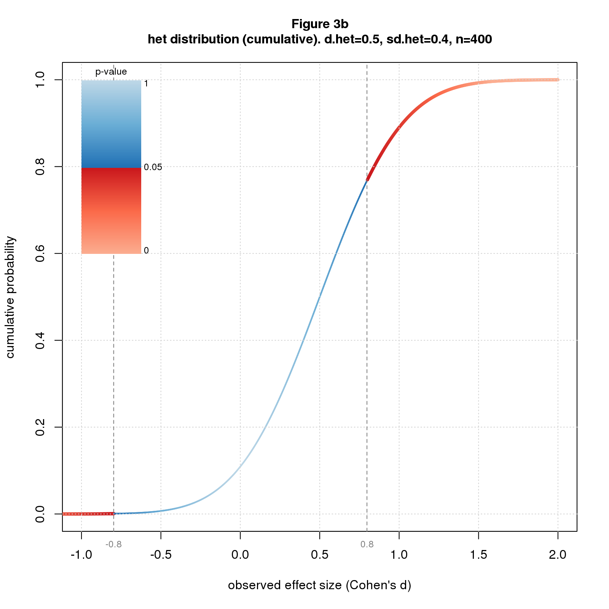
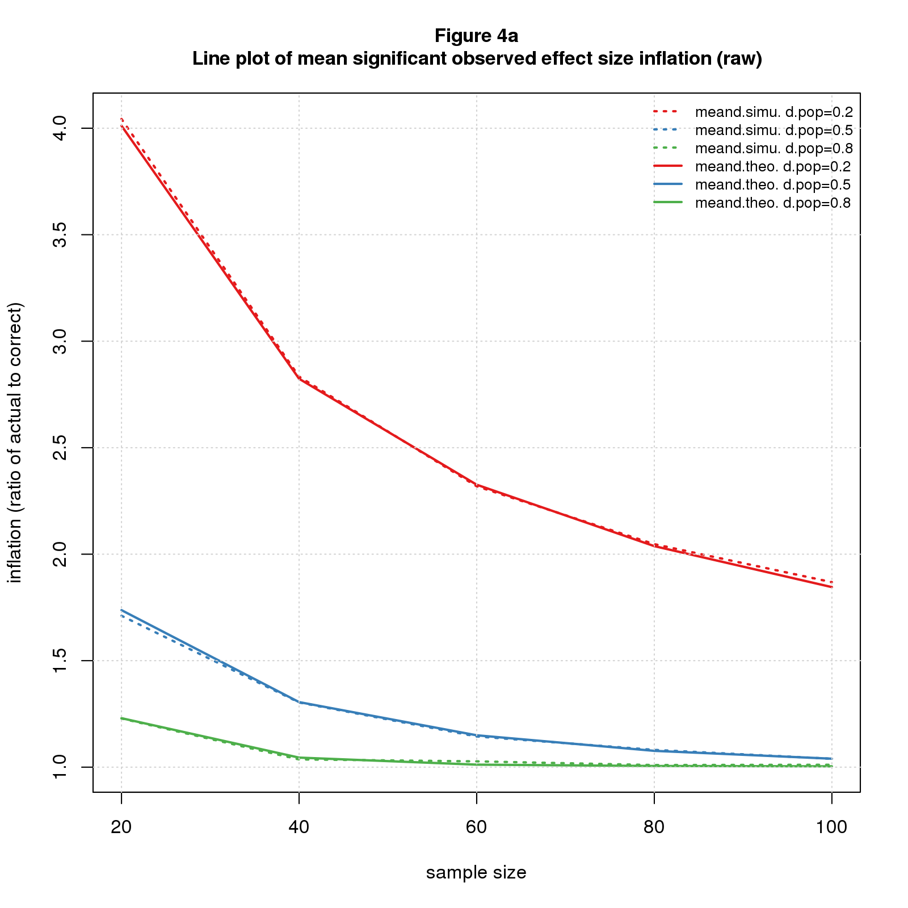
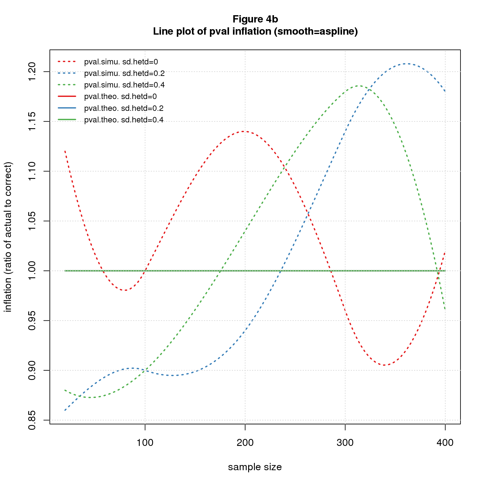

Mistakes of Significance
================
Nathan (Nat) Goodman
May 17, 2019

<!-- README.md is generated from README.Rmd. Please edit that file -->
A collection of R scripts and documents exploring mistakes made by significance testing. The content at present are

-   blog post [When You Select Significant Findings, You’re Selecting Inflated Estimates](https://replicationnetwork.com/2019/02/16/goodman-when-youre-selecting-significant-findings-youre-selecting-inflated-estimates/) whose main point is that significance testing is a biased procedure that overestimates effect size; also available on my website [here](https://natgoodman.github.io/misig/ovrfx.stable.html)
-   blog post [Your P-Values are Too Small! And So Are Your Confidence Intervals!](https://replicationnetwork.com/2019/05/01/your-p-values-are-too-small-and-so-are-your-confidence-intervals/) which explores the impact of heterogeneous effect sizes on p-values and confidence intervals; also available on my website [here](https://natgoodman.github.io/misig/ovrht.stable.html)
-   supplementary material for the blog posts TBD

**THE SOFTWARE IS A WORK IN PROGRESS. THE CODE IS ROUGH and SOFTWARE DOCUMENTATION NONEXISTENT. PLEASE GET IN TOUCH IF YOU NEED HELP**

Installation and Usage
----------------------

The software is **not a package** and cannot be installed by `devtools::install_github` or related. Sorry. The simplest way to get the software is to download or clone the entire repo.

The code mostly uses base R capabilities but has a few dependencies: `RColorBrewer`, `akima`, `knitr`, and `pryr`. Since it's not a package, you have to manually install these packages if you don't already have them.

The recommended way to run the program is to `source` the file `R/run.R` into your R session; `R/run.R` will source the rest. Once loaded, you can run the program by executing the statement `run()` as shown below.

``` r
## This code block assumes your working directory is the root of the distribution

source('R/run.R');
run();
```

This runs the program in a demo-like mode that quickly generates the data and produces the figures and table that appear in this README document. The default computation runs three kinds of simulations totaling 47,000 instances, generates 10 other small data files, and produces 8 figures and one table. The data generation takes about 11 seconds on my small Linux server; the figures and table take about 20 seconds, much of which is spent rendering the plots over a remote X11 connection.

The code that generates the data is in `R/dat_readme.R`; the code that creates the figures and table is in `R/doc_readme.R`.

You can run each part separately by running one or more of the statements below.

``` r
## This code block assumes your working directory is the root of the distribution
## and you've already sourced R/run.R into your session

init(doc='readme');          # you MUST specify doc to run the program in pieces
dodat();                     # generate data
dodoc();                     # generate figures and tables
dodoc(save.out=F);           # generate figures and tables without saving them
dodoc(figscreen=F);          # generate and save figures without plotting to screen. much faster!
```

The program can also generate the data and outputs for the documents associated with the project. To generate these, execute `run()` with a suitable `doc` argument as shown below.

``` r
## This code block assumes your working directory is the root of the distribution.

source('R/run.R');
run(doc='ovrfx');            # run code for blog post on significant effect size inflation
```

The `doc` arguments for each document are

<table style="width:75%;">
<colgroup>
<col width="37%" />
<col width="37%" />
</colgroup>
<thead>
<tr class="header">
<th>document</th>
<th><code>doc</code> argument</th>
</tr>
</thead>
<tbody>
<tr class="odd">
<td><a href="https://replicationnetwork.com/2019/02/16/goodman-when-youre-selecting-significant-findings-youre-selecting-inflated-estimates/">When You Select Significant Findings, You’re Selecting Inflated Estimates</a></td>
<td><code>ovrfx</code></td>
</tr>
<tr class="even">
<td><a href="https://replicationnetwork.com/2019/05/01/your-p-values-are-too-small-and-so-are-your-confidence-intervals/">Your P-Values are Too Small! And So Are Your Confidence Intervals!</a></td>
<td><code>ovrht</code></td>
</tr>
<tr class="odd">
<td>supplementary material for the blog posts TBD</td>
<td>TBD</td>
</tr>
</tbody>
</table>

Nomenclature
------------

<table>
<colgroup>
<col width="12%" />
<col width="12%" />
<col width="74%" />
</colgroup>
<thead>
<tr class="header">
<th>in code</th>
<th>in text</th>
<th>meaning</th>
</tr>
</thead>
<tbody>
<tr class="odd">
<td><code>n</code></td>
<td><span class="math inline"><em>n</em></span></td>
<td>sample size</td>
</tr>
<tr class="even">
<td><code>d.pop</code></td>
<td><span class="math inline"><em>d</em><sub><em>p</em><em>o</em><em>p</em></sub></span></td>
<td>population effect size</td>
</tr>
<tr class="odd">
<td><code>d.sdz</code></td>
<td><span class="math inline"><em>d</em><sub><em>s</em><em>d</em><em>z</em></sub></span></td>
<td>standardized observed effect size, aka Cohen's d</td>
</tr>
<tr class="even">
<td><code>d.het</code></td>
<td><span class="math inline"><em>d</em><sub><em>h</em><em>e</em><em>t</em></sub></span></td>
<td>mean of heterogeneous population distribution</td>
</tr>
<tr class="odd">
<td><code>sd.het</code></td>
<td><span class="math inline"><em>s</em><em>d</em><sub><em>h</em><em>e</em><em>t</em></sub></span></td>
<td>standard deviation of heterogeneous population distribution</td>
</tr>
<tr class="even">
<td><code>d</code></td>
<td><span class="math inline"><em>d</em></span></td>
<td>variously means either <span class="math inline"><em>d</em><sub><em>p</em><em>o</em><em>p</em></sub></span>, <span class="math inline"><em>d</em><sub><em>s</em><em>d</em><em>z</em></sub></span>, or <span class="math inline"><em>d</em><sub><em>h</em><em>e</em><em>t</em></sub></span>; hopefully clear from context</td>
</tr>
<tr class="odd">
<td><code>meand.simu</code></td>
<td><span class="math inline"><em>m</em><em>e</em><em>a</em><em>n</em><em>d</em><sub><em>s</em><em>i</em><em>m</em><em>u</em></sub></span></td>
<td>mean significant observed effect size computed from simulated data</td>
</tr>
<tr class="even">
<td><code>meand.theo</code></td>
<td><span class="math inline"><em>m</em><em>e</em><em>a</em><em>n</em><em>d</em><sub><em>t</em><em>h</em><em>e</em><em>o</em></sub></span></td>
<td>mean significant observed effect size computed analytically</td>
</tr>
<tr class="odd">
<td><code>pval.simu</code></td>
<td><span class="math inline"><em>p</em><em>v</em><em>a</em><em>l</em><sub><em>s</em><em>i</em><em>m</em><em>u</em></sub></span></td>
<td>p-value computed from simulated data</td>
</tr>
<tr class="even">
<td><code>pval.theo</code></td>
<td><span class="math inline"><em>p</em><em>v</em><em>a</em><em>l</em><sub><em>t</em><em>h</em><em>e</em><em>o</em></sub></span></td>
<td>p-value computed analytically</td>
</tr>
</tbody>
</table>

<br/>

The program performs three types of simulations.

1.  *rand*. Randomly selects a large number of *d*<sub>*p**o**p*</sub>s, sets *n* to a range of values, and simulates one study for each *d*<sub>*p**o**p*</sub> and *n*.
2.  *fixd*. Fixes *d*<sub>*p**o**p*</sub> to a few values of interest, sets *n* to a range of values, and simulates many studies for each *d*<sub>*p**o**p*</sub> and *n*.
3.  *hetd*. Sets *d*<sub>*h**e**t*</sub> and *s**d*<sub>*h**e**t*</sub> to a few values of interest, and selects a large number of *d*<sub>*p**o**p*</sub>s from normal distributions with mean *d*<sub>*h**e**t*</sub> and standard deviation *s**d*<sub>*h**e**t*</sub>. Then sets *n* to a range of values, and simulates one study for each *d*<sub>*p**o**p*</sub> and *n*.

The program implements two data generation models:

1.  *fixed effect (fix)* which imagines we're repeating a study an infinite number of times, drawing a different sample each time from a population with a fixed true effect size
2.  *heterogeneous effect (het)* which assumes that each time we do the study, we’re sampling from a different population with a different true effect size

Figures and Tables
------------------

The default mode produces figures that illustrate the kinds of graphs the program can produce.

1.  *d* vs. *d* scatter plot colored by p-value; by default *d*<sub>*p**o**p*</sub> vs. *d*<sub>*s**d**z*</sub>
2.  histogram typically of *d*<sub>*s**d**z*</sub> colored by p-value
3.  probability distribution vs. *d*<sub>*s**d**z*</sub> colored by p-value; can compute probability density or cumulative probability internally, or you can pass the distribution into the function
4.  multiple line plot; my adaptation of R's `matplot`

The first figure shows a *d* vs. *d* scatter plot of *rand* simulated data for *n* = 20. The second uses the same data but zooms in to the critical region where p-values switch from nonsignificant to significant.



Next are two histograms of *fixd* simulated data with different values for *d*<sub>*p**o**p*</sub> and *n*.



The next two are sampling distributions for the *het* model with different values for *d*<sub>*h**e**t*</sub>, *s**d*<sub>*h**e**t*</sub>, and *n*. The first shows probability density, the second cumulative probability.



The final block are line plots. The first shows mean significant observed effect size inflation for the *fix* model. The second shows p-value inflation for the *het* model. The first has raw data; the second applies a smoothing function. Both figures depict simulated and analytic results to illustrate the concordance.



Finally, here is a table of supporting data.

| what       |  d.crit|  md20\_0.2|  md20\_0.5|  md20\_0.8|  ov20\_0.2|  ov20\_0.5|  ov20\_0.8|  nov\_0.2|  nov\_0.5|  nov\_0.8|
|:-----------|-------:|----------:|----------:|----------:|----------:|----------:|----------:|---------:|---------:|---------:|
| meand.fixd |    0.64|       0.80|       0.87|       0.98|       3.98|       1.75|       1.23|    175.31|     46.74|     17.95|
| meand.d2t  |    0.64|       0.79|       0.86|       0.98|       3.97|       1.72|       1.22|    166.70|     46.64|     16.69|

Comments Please!
----------------

Please post comments on [Twitter](https://twitter.com/gnatgoodman) or [Facebook](https://www.facebook.com/nathan.goodman.3367), or contact me by email <natg@shore.net>.

Please report bugs, other software problems, and feature requests using the [GitHub Issue Tracker](https://github.com/natgoodman/effit/issues). I will be notified, and you'll be apprised of progress. As already noted, the software is still rough and software documentation nonexistent.

Copyright & License
-------------------

Copyright (c) 2019 Nathan Goodman

The software is **open source and free**, released under the [MIT License](https://opensource.org/licenses/MIT). The documentation is **open access**, released under the [Creative Commons Attribution 4.0 International License](https://creativecommons.org/licenses/by/4.0).
