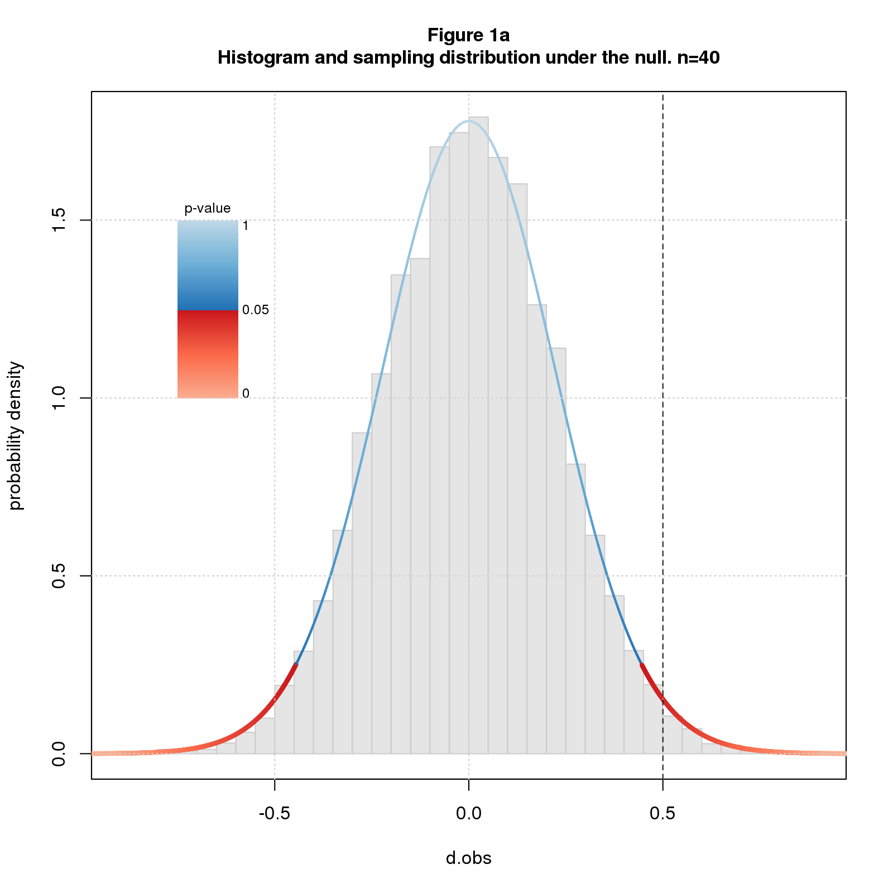
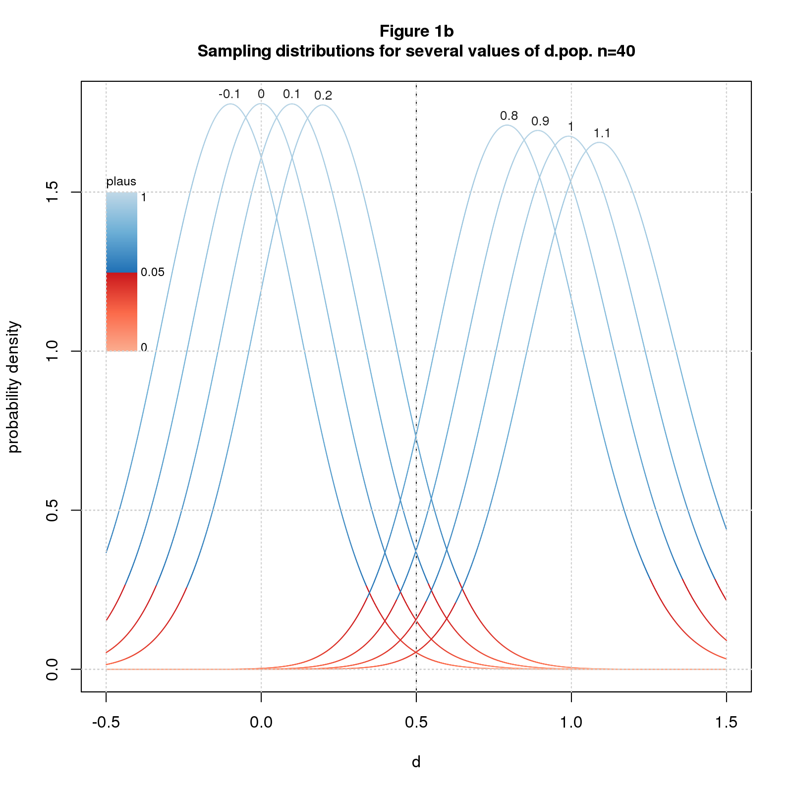
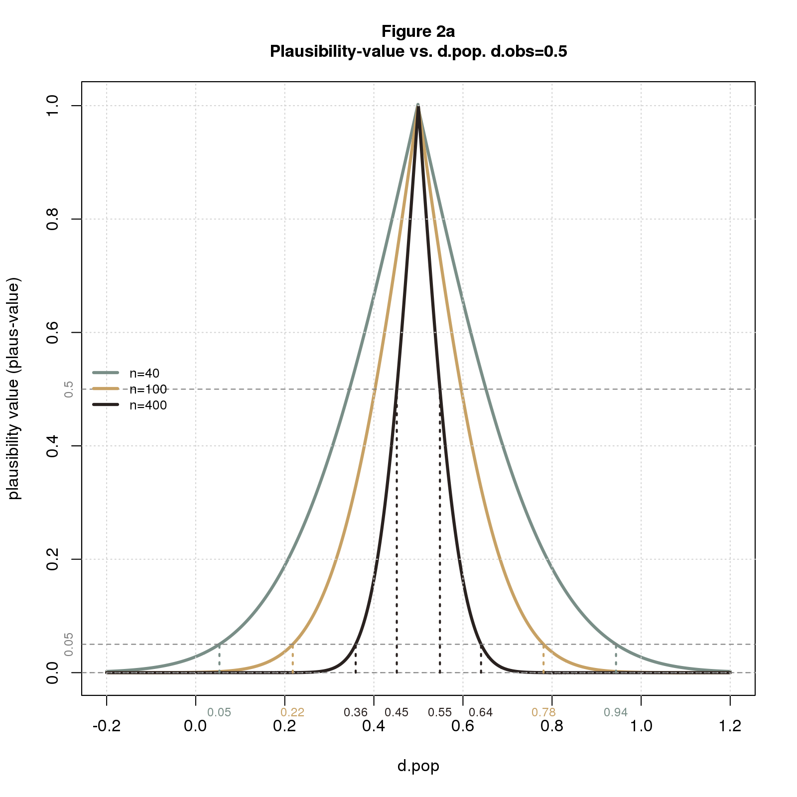
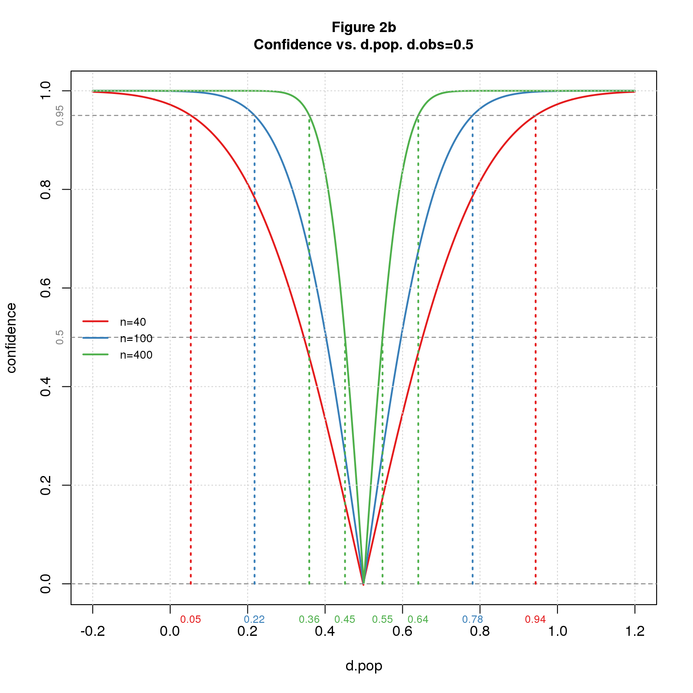
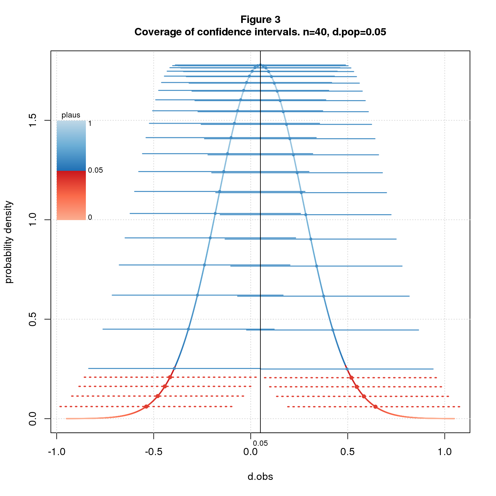

*Confidence intervals get top billing as the alternative to significance. But beware: confidence intervals rely on the same math as significance and share the same shortcominings. Confidence intervals don't tell where the true effect lies even probabilistically. What they do is delimit a range of true effects that are broadly consistent with the observed effect.*

Confidence intervals, like p-values and power, imagine we're repeating a study an infinite number of times, drawing a different sample each time from the same population. Though unnatural for basic, exploratory research, it's a useful mathematical trick that let's us define the concept of *sampling distribution* - the distribution of expected results - which in turn is the basis for many common stats. The math is the same across the board; I'll start with a pedantic explanation of p-values, then generalize the terminology a bit, and use the new terminology to explain confidence intervals.

Recall that the (two-sided) p-value for an observed effect $d_{obs}$ is the probability of getting a result as or more extreme than $d_{obs}$ *under the null*. "Under the null" means we assume the population effect size $d_{pop}=0$. In math terms, the p-value for $d_{obs}$ is the tail probability of the sampling distribution - the area under the curve beyond $d_{obs}$ - times $2$ to account for the two sides. Recall further that we declare a result to be *significant* and *reject the null* when the tail probability is so low that we deem it implausible that $d_{obs}$ came from the null sampling distribution.

Figure 1a shows a histogram of simulated data overlaid with the sampling distribution for sample size $n=40$ and $d_{pop}=0$. I color the sampling distribution by p-value, switching from blue to red at the conventional significance cutoff of $p=0.05$. The studies are simple two group difference-of-mean studies with equal sample size and standard deviation, and the effect size statistic is standardized difference (aka *Cohen’s d*). The line at $d_{obs}=0.5$ falls in the red indicating that we deem the null hypothesis implausible and reject it.

```{r out.width="50%",echo=FALSE,fig.show='asis'}
;
;
```

Figure 1b shows sampling distributions for $n=40$ and several values of $d_{pop}$. The coloring, analogous to Figure 1a, indicates how plausible we deem $d_{obs}$ given $n$ and $d_{pop}$. The definition of "plausibility value" (*plaus*) is the same as p-value but for arbitrary $d_{pop}$. $d_{obs}=0.5$ is in the red for the outer values of $d_{pop}$ but in the blue for the inner ones. This means we deem $d_{obs}=0.5$ implausible for
the outer values of $d_{pop}$ but plausible for the inner ones. The transition from implausible to plausible happens somewhere between $d_{pop}=0$ and $0.1$; the transition back happens between $0.9$ and $1$. 

Plausibility is a function of three parameters: $n$, $d_{pop}$, and $d_{obs}$. We can compute and plot plaus-values for any combination of the three parameters. 

Figure 2a plots *plaus* vs. $d_{pop}$ for $d_{obs}=0.5$ and several values of $n$. The figure also shows the limits of plausible $d_{pop}$s at points of interest. As with significance, we can declare "plausibility" at thresholds other than $0.05$. From the figure, we see that the limits gets tighter as we increase $n$ or the plausibility cutoff. For $n=40$ and the usual $0.05$ cutoff, the limits are wide: $[0.5, 0.94]$. For $n=400$ and a stringent cutoff of $0.5$, the limits are narrow: $[0.45,0.55]$. This makes perfect sense: (1) all things being equal, bigger samples have greater certainty; (2) a higher cutoff means we demand more certainty before deeming a result plausible, ie, we require that $d_{pop}$ be closer to $d_{obs}$.

```{r out.width="50%",echo=FALSE,fig.show='asis'}
;
;
```

The plausibility limits in Figure 2a are consistent with Figure 1b. Both figures say that with $n=40$ and $d_{obs}=0.5$, $d_{pop}$ must be a little more than $0$ and a little less than $1$ to deem the solution plausible.

Now I'll translate back to standard confidence interval terminology: *confidence level* is $1 - plaus$ usually stated as a percentage; *confidence intervals* are plausibility limits expressed in terms of confidence levels. Figure 2b restates 2a using the standard terminology. It's the same but upside down. This type of plot is called a *consonance curve*.

A further property of confidence intervals, called the *coverage* property, states that if we repeatedly sample from a fixed $d_{pop}$ and compute the C% confidence intervals, C% of the intervals will contain $d_{pop}$. Figure 3 illustrates the property for 95% confidence intervals, $n=40$, and $d_{pop}=0.05$. The figure shows the sampling distribution colored by plaus-value, and confidence intervals as solid blue or dashed red lines depending on whether the interval covers $d_{pop}$. I arrange the intervals along the sampling distribution for visual separation.

```{r out.width="50%",fig.align="center",echo=FALSE,fig.show='asis'}
;
```

Many texts use the coverage property as the definition of confidence interval and plausibility limits as a derived property. This points the reader in the wrong direction: since C% of intervals cover $d_{pop}$, it's natural to believe there's a C% chance that the interval computed from an observed effect size contains $d_{pop}$. This inference is invalid: the interval delimits the range of $d_{pop}$s that are close enough to $d_{obs}$ to be deemed plausible. This says nothing about probability. 

Stats likes strong words: "significance", "power", "confidence". Words matter: "significant" suggests important; "power" suggests the ability to get the right answer; "95% confidence" suggests we're pretty darn sure; "95% confidence interval" and "95% of intervals cover $d_{pop}$" suggest a 95% chance that the true effect falls in the interval. None of these inferences are valid. 

Statistics is fundamentally about uncertainty. Why hide this behind the smog of strong words? There's no surefire way to prevent the misuse of statistics, but better language can only help. Words that scream "weak and uncertain" - words like "plausible" - are a step in the right direction.

## Comments Please!

Please post comments on [Twitter](https://twitter.com/gnatgoodman) or [Facebook](https://www.facebook.com/nathan.goodman.3367), or contact me by email [natg@shore.net](mailto:natg@shore.net).
