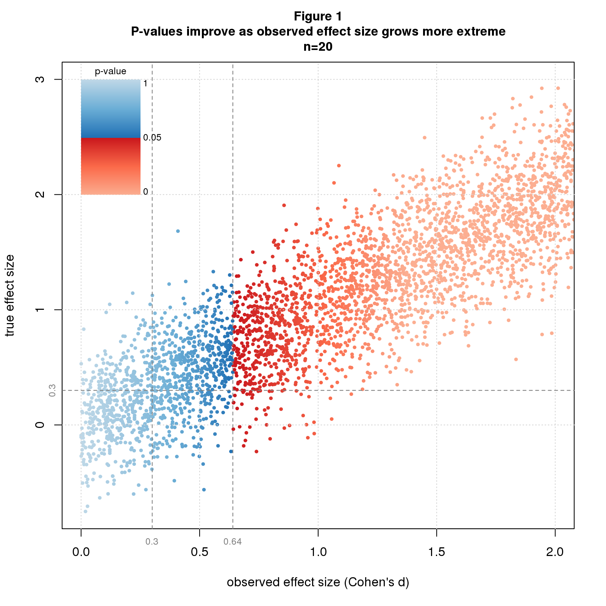
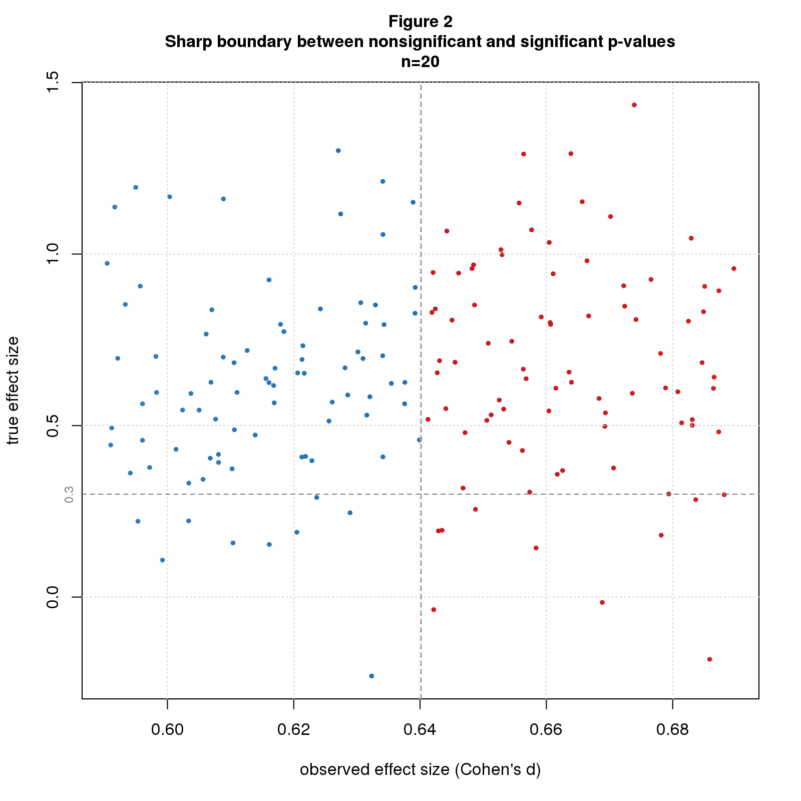
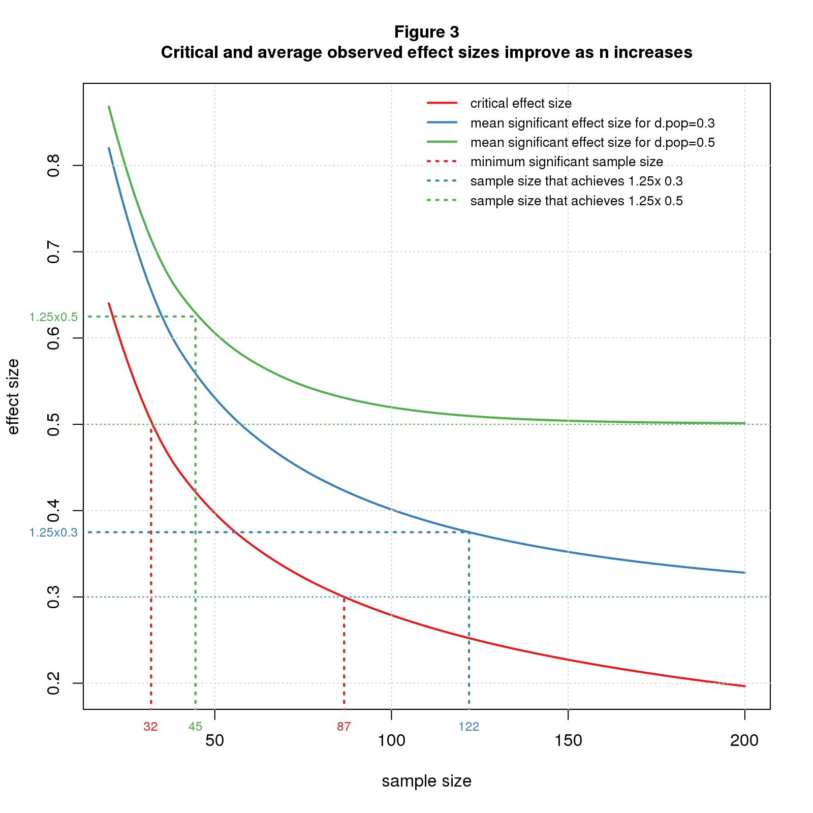

*Replication researchers cite inflated effect sizes as a major cause of replication failure. It turns out this is an inevitable consequence of significance testing. The reason is simple. The p-value you get from a study depends on the observed effect size, with bigger[^1] observed effect sizes giving better p-values; the true effect size plays no role. Significance testing selects studies with good p-values, hence large observed effect sizes. This selection bias guarantees that on average, the observed effect size will inflate the true effect size. The overstimate is large, 2-3x, under conditions typical in social science research. Possible solutions are to increase sample size or effect size or abandon significance testing.*

[^1]: I assume effect sizes *>0* so I can use terms like "bigger" and "smaller" rather than "more extreme" and "less extreme".

Figure 1 illustrates the issue using simulated data from a two group difference of mean study with sample size (*n*) of 20 using standardized difference, aka *Cohen's d*, as the effect size statistic. From what I read in the blogosphere, the typical true effect size (*d*) in social science research is 0.3. For this example, all significant points (the red ones) have observed effect sizes beyond 0.3. In other words, all significant studies overestimate the true effect size. The red points extend well to the right suggesting that the average observed effect might be quite high. I'll get to this shortly. 

Figure 2 zooms into the region where the p-values switch from nonsignifiant to significant (blue to red). There's a sharp boundary at about 0.64. This is a *critical value* that depends only on *n*. 

```{r out.width="50%",echo=FALSE,fig.show='asis'}
;
;
```

The critical effect size is the minimum significant effect size you can get for a given *n*. When the critical effect size is less than the true effect size, every significant study will overestimate the true effect size. 

The average significant effect size is greater than the critical value and depends on both *n* and *d*. Figure 3 plots the critical and average effect sizes for a range of *n* and *d*. Let's look first at *n=20*. For *d=0.3* the average is 0.82, an overestimate of 2.7x. A modest increase in effect size helps a lot. For *d=0.5* (still "medium" in Cohen's d vernacular), the average is 0.87, an overestimate of 1.7x. To reduce the overestimate to a reasonable level, say 1.25x, we need *n=122* for *d=0.3*, but only *n=45* for *d=0.5*.

```{r out.width="50%",echo=FALSE,fig.show='asis'}
;
```

Significance testing is a biased procedure that overestimates effect size. This is common knowledge among statisticians yet seems to be forgotten in the replication crisis literature and is rarely explained to statistics users. I hope this post will give readers a visual understanding of the problem and under what conditions it may be worrisome. Shravan Vasishth offers another good explanation in [his excellent TRN post](https://replicationnetwork.com/2018/09/11/vasishth-the-statistical-significance-filter-leads-to-overoptimistic-expectations-of-replicability/) and [related paper](https://www.sciencedirect.com/science/article/pii/S0749596X18300640).

You can mitigate the bias by increasing sample size or true effect size. There are costs to each. Bigger studies are more expensive. They're also harder to run and may require more study personnel and study days, which may increase variability and indirectly reduce the effect size. Increasing the effect size typically involves finding study conditions that amplify the phenomenon of interest. This may reduce the ability to generalize from lab to real world. All in all, it's not clear that the net effect is positive.

A cheaper  solution is to abandon significance testing. The entire problem is a consequence of this timeworn statistical method. Looking back at Figure 1, observed effect size tracks true effect size pretty well. There's uncertainty, of course, but that seems an acceptable tradeoff for gaining unbiased effect size estimates at reasonable cost.

## Comments Please!

Please post comments on [Twitter](https://twitter.com/gnatgoodman) or [Facebook](https://www.facebook.com/nathan.goodman.3367), or contact me by email [natg@shore.net](mailto:natg@shore.net).
