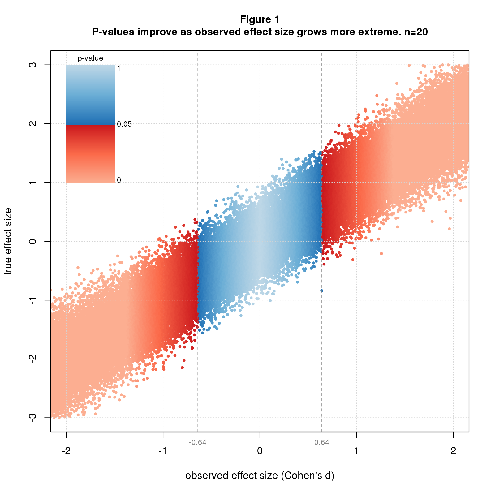
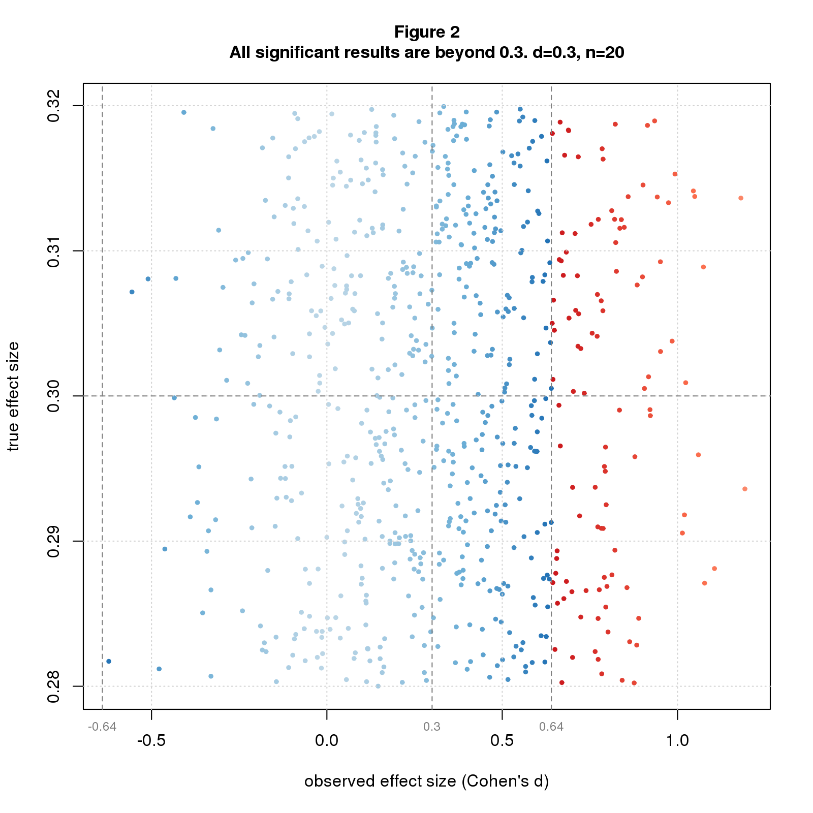
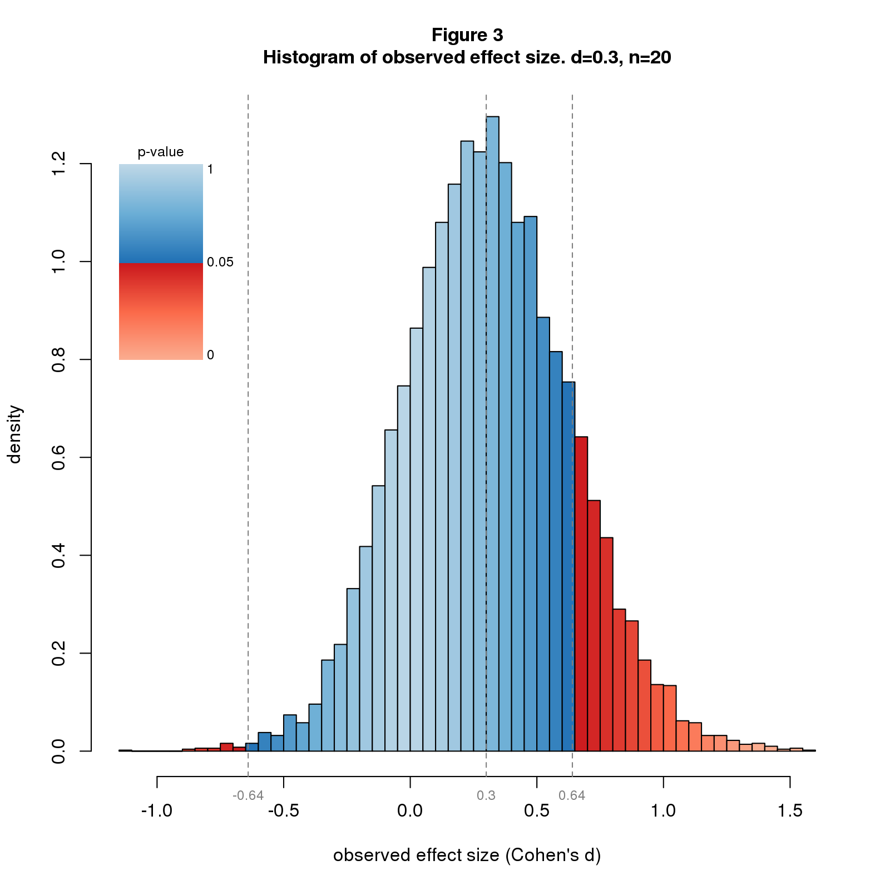
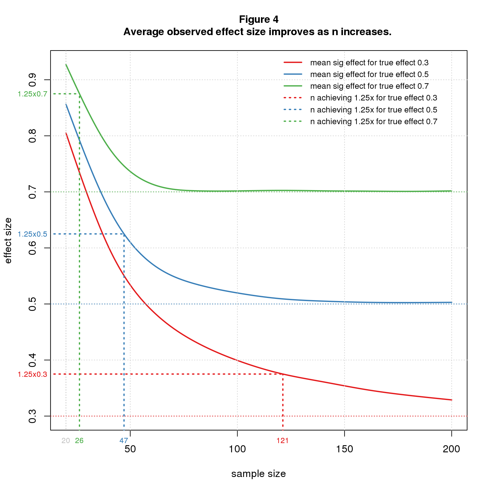

*Replication researchers cite inflated effect sizes as a major cause of replication failure. It turns out this is an inevitable consequence of significance testing. The reason is simple. The p-value you get from a study depends on the observed effect size, with bigger[^1] observed effect sizes giving better p-values; the true effect size plays no role. Significance testing selects studies with good p-values, hence large observed effect sizes. This selection bias guarantees that on average, the observed effect size will inflate the true effect size. The overstimate is large, 2-3x, under conditions typical in social science research. Possible solutions are to increase sample size or effect size or abandon significance testing.*

[^1]: I should say "more extreme" or "bigger absolute value" to cover negative effect sizes.

Figure 1 illustrates the issue using simulated data colored by p-value. The simulation randomly selects true effect sizes, then simulates a two group difference-of-mean study with sample size *n=20* for each true effect size. The effect size statistic is standardized difference, aka *Cohen's d*, and p-values are from the t-test. The figure shows a scatter plot of true vs. observed effect size with blue and red dots depicting nonsignificant and significant studies. The transition from blue to red at &plusmn; 0.64 is a *critical value* that sharply separates nonsignificant from significant results. This value depends only on *n* and is the minimum significant effect size for a given *n*. 

From what I read in the blogosphere, the typical true effect size in social science research is *d=0.3*. Figure 2 zooms into the region around *d=0.3*. All significant points (the red ones) have observed effect sizes well beyond 0.3. In other words, all significant studies inflate the true effect size. 

```{r out.width="50%",echo=FALSE,fig.show='asis'}
;
;
```

The average significant effect size depends on both *d* and *n*. To explore this I use a simulation that fixes *d* to a few values of interest, sets *n* to a range of values, and simulates many studies for each *d* and *n*. Figure 3 shows a histogram of observed effect sizes for *d=0.3* and *n=20*. The significant results are way out on the tail, indicating that the average will be large. Figure 4 plots the average for *d* of 0.3, 0.5, and 0.7 and *n* ranging from 20 to 200. Let's look first at *n=20*. For *d=0.3* the average is 0.81, an overestimate of 2.7x. A modest increase in effect size helps a lot. For *d=0.5* (still "medium" in Cohen's d vernacular), the average is 0.86, an overestimate of 1.7x. For *d=0.7*, the overestimate is 1.3x. To reduce the overestimate to a reasonable level, say 1.25x, we need *n=121* for *d=0.3*, but only *n=47* for *d=0.5*, and *n=26* for *d=0.7*.

```{r out.width="50%",echo=FALSE,fig.show='asis'}
;
;
```

Significance testing is a biased procedure that overestimates effect size. This is common knowledge among statisticians yet seems to be forgotten in the replication literature and is rarely explained to statistics users. I hope this post will give readers a visual understanding of the problem and under what conditions it may be worrisome. Shravan Vasishth offers another good explanation in [his excellent TRN post](https://replicationnetwork.com/2018/09/11/vasishth-the-statistical-significance-filter-leads-to-overoptimistic-expectations-of-replicability/) and [related paper](https://www.sciencedirect.com/science/article/pii/S0749596X18300640).

You can mitigate the bias by increasing sample size or true effect size. There are costs to each. Bigger studies are more expensive. They're also harder to run and may require more study personnel and study days, which may increase variability and indirectly reduce the effect size. Increasing the effect size typically involves finding study conditions that amplify the phenomenon of interest. This may reduce the ability to generalize from lab to real world. All in all, it's not clear that the net effect is positive.

A cheaper  solution is to abandon significance testing. The entire problem is a consequence of this timeworn statistical method. Looking back at Figure 1, observed effect size tracks true effect size pretty well. There’s uncertainty, of course, but that seems an acceptable tradeoff for gaining unbiased effect size estimates at reasonable cost.

## Comments Please!

Please post comments on [Twitter](https://twitter.com/gnatgoodman) or [Facebook](https://www.facebook.com/nathan.goodman.3367), or contact me by email [natg@shore.net](mailto:natg@shore.net).
