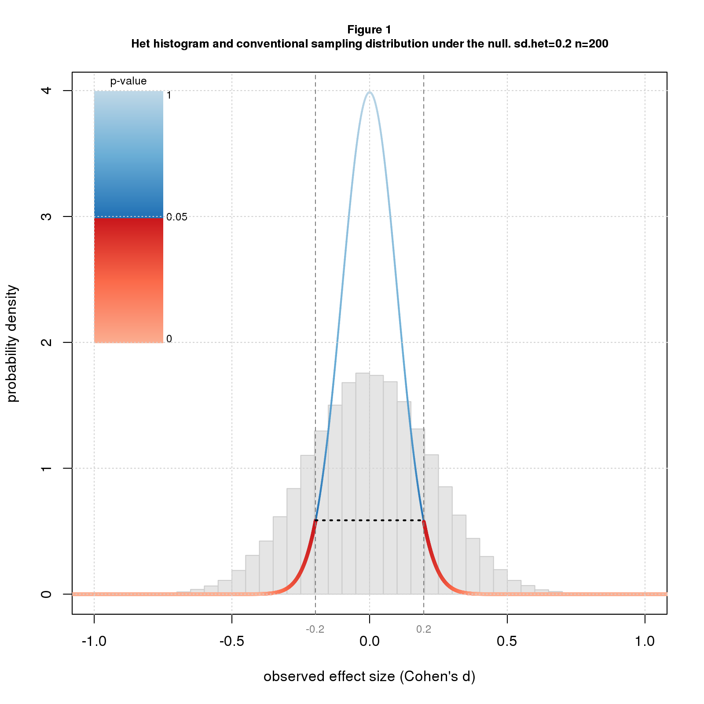
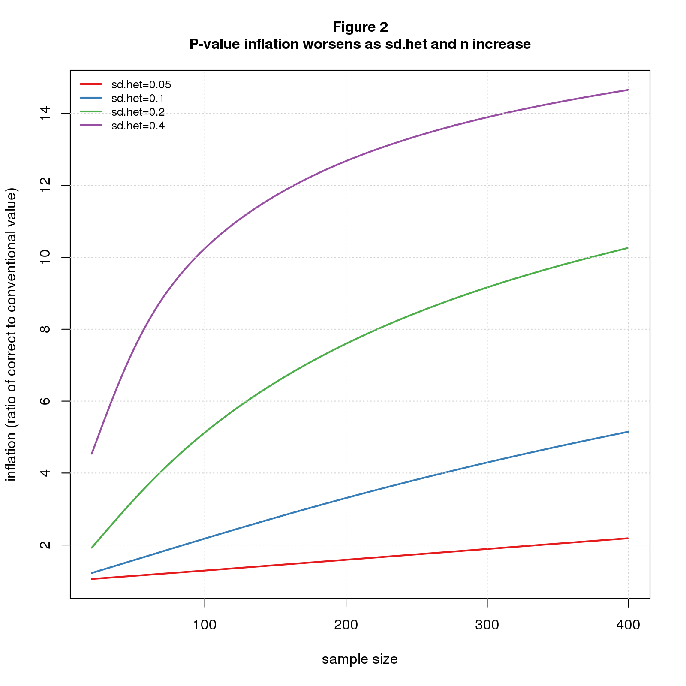
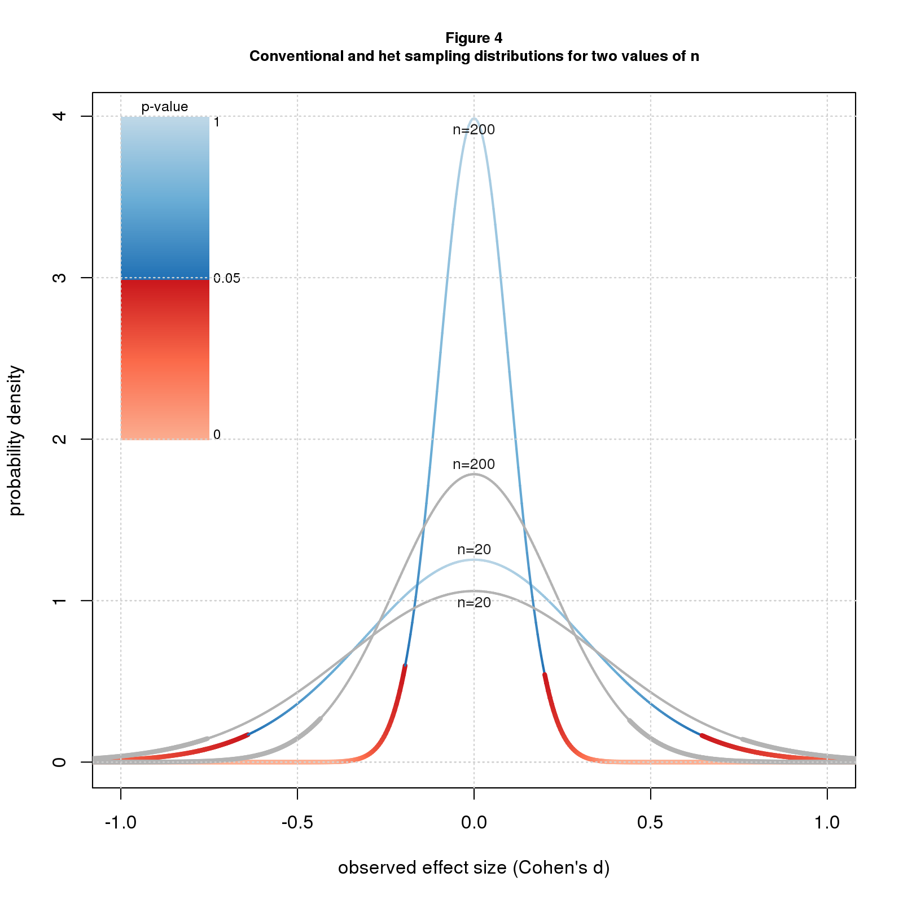

*An oft-overlooked detail in the significance debate is the challenge of calculating correct p-values and confidence intervals, the favored statistics of the two sides. Standard methods rely on assumptions about how the data were generated and can be way off when the assumptions don't hold. Papers on heterogenous effect sizes by [Kenny and Judd](https://osf.io/qs9xw/) and [McShane and Böckenholt](https://doi.org/10.1177/1745691614548513) present a compelling scenario where the standard calculations are highly optimistic. Even worse, the errors grow as the sample size increases, negating the usual heuristic that bigger samples are better.*

Standard methods like the t-test imagine that we're repeating a study an infinite number of times, drawing a different sample each time from a population with a fixed true effect size. A competing, arguably more realistic, model is the heterogeneous effect size model (*het*). This assumes that each time we do the study, we’re sampling from a different population with a different true effect size. [Kenny and Judd](https://osf.io/qs9xw/) suggest that the population differences may be due to “variations in experimenters, participant populations, history, location, and many other factors… we can never completely specify or control.”

In the meta-analysis literature, the *het* model is called the "random effects model" and the standard model the "fixed effects model". While the distinction is well-recognized, the practical implications may not be. The purpose of this blog is to illustrate the practical consequences of the *het* model for p-values and confidence intervals.

I model the *het* scenario as a two stage random process. The first stage selects a population effect size, $d_{pop}$, from a normal distribution with mean $d_{het}$ and standard deviation $sd_{het}$. The second carries out a two group difference-of-mean study with that population effect size: it selects two random samples of size $n$ from standard normal distributions, one with $mean=0$ and the other with $mean=d_{pop}$, and uses standardized difference, aka *Cohen’s d*, as the effect size statistic. The second stage is simply a conventional study with population effect size $d_{pop}$. $d_{het}$, the first stage mean, plays the role of true effect size.

Figure 1 shows a histogram of simulated *het* results under the null ($d_{het}=0$) with $sd_{het}=0.2$ for $n=200$. Overlaid on the histogram is the sampling distribution for the conventional scenario colored by conventional p-value along with the 95% confidence interval. Note that the histogram is wider than the sampling distribution. 

```{r out.width="50%",echo=FALSE,fig.show='asis'}
;
```

Recall that the p-value for an effect $d$ is the probability of getting a result as or more extreme than $d$ under the null. Since the histogram is wider than the sampling distribution, it has more data downstream of the point where $p=0.05$ (where the color switches from blue to red) and so the correct p-value is more than 0.05. In fact the correct p-value is much more: 0.38. The confidence interval also depends on the width of the distribution and is wider than for the conventional case: -0.44 to 0.44 rather than -0.20 to 0.20.

Note that effect size heterogeneity "inflates" both the true p-value and true confidence interval. In this particular example, *p-value inflation* is 7.6 (0.38/0.05), and *confidence interval inflation* is 2.2 (0.44/0.20). In general, these inflation factors will change with $sd_{het}$ and $n$. Figures 2 and 3 plot p-value and confidence interval inflation vs. $n$ for several values of $sd_{het}$. The p-value results (Figure 2) show inflation when the conventional p-value is barely significant ($p=0.05$); the confidence interval results (Figure 3) are for $d=0$ (same as Figure 1).

```{r out.width="50%",echo=FALSE,fig.show='asis'}
;
knitr::include_graphics('figure/ovrht/figure_003_ci_inflation.png');
```

Not surprisingly, the results get worse as heterogeneity increases. For $n=200$, p-value inflation grows from 1.59 when $sd_{het}=0.05$ to 12.68 for $sd_{het}=0.4$; over the same range, confidence interval inflation grows from 1.12 to 4.12.

More worrisome is that the problem also gets worse as the sample size increases. For $sd_{het}=0.05$, p-value inflation grows from a negligible 1.05 when $n=20$ to 1.59 for $n=200$ and 2.19 for $n=400$; the corresponding values for confidence interval inflation are 1.01, 1.12, and 1.22. For $sd_{het}=0.2$, p-value inflation grows from 1.90 for $n=20$ to 10.26 for $n=400$, while confidence interval inflation increases from 1.18 to 3.00.

What’s driving this sample size dependent inflation is that increasing $n$ tightens up the second stage (where we select samples of size $n$) but not the first (where we select $d_{pop}$). As $n$ grows and the second stage becomes narrower, the unchanging width of the first stage becomes proportionally larger.

Another way to see it is to compare the sampling distributions. Figure 4 shows sampling distributions for $n=20$ and $n=200$ for the conventional scenario (colored by p-value) and the *het* scenario (in grey) for $sd_{het}=0.2$. For $n=20$, the *het* (grey) curve is only slightly wider than the conventional one, while for $n=200$ the difference is much greater. In both scenarios, the distributions are tighter for the larger $n$, but the conventional curve gets tighter faster.

```{r out.width="50%",echo=FALSE,fig.show='asis'}
;
```

If you believe that the heterogeneous effects model better depicts reality than the conventional model, it follows that p-values and confidence intervals computed by standard statistical packages are too small. Further, it's impossible to know how much they should be adjusted. 

Is this another argument for "retiring statistical significance?" Maybe. But even if one wants to keep significance on the payroll, these results argue for giving less weight to p-values and confidence intervals when assessing the results of statistical tests. More holistic and, yes, subjective interpretations are warranted.

## Comments Please!

Please post comments on [Twitter](https://twitter.com/gnatgoodman) or [Facebook](https://www.facebook.com/nathan.goodman.3367), or contact me by email [natg@shore.net](mailto:natg@shore.net).
